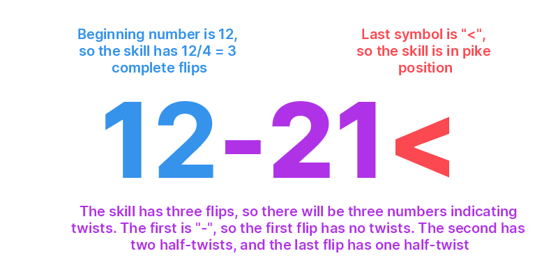

# Trampoline DD Calculator
Try it now at [ddcalc.net](https://ddcalc.net)!

## Features
- Calculates the degree of difficulty (DD) of trampoline, double-mini, and tumbling skills according to the [FIG 2022-2024 Code of Points](https://www.gymnastics.sport/publicdir/rules/files/en_TRA%20CoP%202022-2024.pdf)
- Calculates the degree of difficulty of routines
- Can check if sets of routines are valid (do not contain duplicates)

## Usage
### Single Skills
Single skills can be entered by simply entering their string in [FIG Notation](#Fig-Notation)

### Routines
Routines can be entered by entering multiple skills separated by spaces. Routine lengths are not checked, but each event has a standard number of skills per routine:
- Trampoline: 10
- Double-mini: 2
- Tumbling: 8

### Routine sets
Routines can be grouped into sets by enclosing each routine in curly braces `{}`. Routine sets may not contain duplicates.

## FIG Notation
FIG Notation is a method of encoding trampoline gymnastics skills in a short string. A detailed description can be found [here](https://nightflyers.co.uk/wp/trampolining/tariff-judging/).

Put simply, a FIG Notation string encodes three pieces of information
- The number of flips in the skill (measured in quarter flips)
- The number of twists in the skill (measured in half-twists)
- The position of the skill (either tuck (`o`), pike (`<`), or layout (`/`))

This information is found as follows:
- The first one (or possibly two) character in the string represent the number of quarter flips. These are often a multiple of 4
- The last character represents the position
- Each middle character represents the number of twists in one flip; if the skill contains multiple flips, there will be multiple numbers in the middle. The first number corresponds to the number of twists in the first flip, the second to the second, etc.
  - If no twists are present in a given flip, a dash `-` is used

Note that there is no delineation between forwards and backwards flipping because they have the same degree of difficulty (with the exception of tumbling)

### Tumbling Notation
Notation for tumbling is slightly different:
- The number of flips in a skill is not given; the number of flips is determined by the number of twist entries, which use the same system as the regular notation
- A period `.` can be used to indicate that the skill flips forward; otherwise, backward flipping is assumed. This delineation is made because forwards flipping skills on tumbling have higher DD than their backwards flipping counterparts.

In addition, the tumbling event contains some skills that are not gracefully described by existing notation, so they are referred to by special symbols:
- Roundoff: `(`
- Back Handspring: `f`
- Tempo (whip): `^`
- Front Handspring: `h`

## TODO
- Ensure that the results of floating point errors are not displayed without rounding
- Fix style of subheaders in information pane
- Add explanation of FIG notation into the site directly
